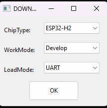
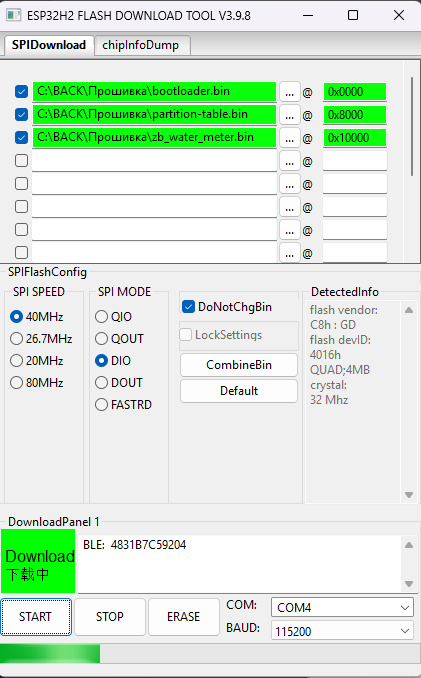

# 💧 Умный Zigbee-счётчик воды для Home Assistant (ESP32-H2)

## 🔍 Что это такое?

Прошивка превращает **ESP32-H2** в Zigbee-счётчик воды, подключаемый к импульсному датчику (например, от фильтра обратного осмоса). Устройство передаёт данные в **Home Assistant** через **Zigbee2MQTT** или **ZHA** и помогает отслеживать расход воды.

📌 Основные цели:
- Учёт объёма фильтрованной воды
- Отслеживание потока в реальном времени
- Уведомления и напоминания в Home Assistant

## ⚙️ Возможности

- Поддержка **Zigbee** (через `esp-zigbee-sdk`)
- Расчёт:
  - **Общий расход (`energy`)** — литры
  - **Мгновенный расход (`power`)** — литры в секунду
- Поддержка Zigbee кластеров:
  - `Metering` (`currentSummDelivered`) – общий расход
  - `instantaneousDemand` – мгновенный расход
- Энергонезависимое хранение данных в NVS
- Совместимость с **Zigbee2MQTT** и **ZHA**

## 📥 Прошивка

Скачайте три файла:

- `bootloader.bin` — 📎 [Скачать](#)
- `partition-table.bin` — 📎 [Скачать](#)
- `zb_water_meter.bin` — 📎 [Скачать](#)

## 🪟 Как прошить (Windows)

1. Установите [ESP32 Flash Download Tool](https://www.espressif.com/en/support/download/other-tools)
2. Подключите ESP32-H2 к компьютеру
3. В `flash_download_tool.exe` выберите:
  <p align="left">
  
  </p>
  
   - ChipType: `ESP32-H2`
   - WorkMode: `Develop`
   - LoadMode: `UART`
     
5. Укажите файлы и адреса:
   - `bootloader.bin` → `0x0000`
   - `partition-table.bin` → `0x8000`
   - `zb_water_meter.bin` → `0x10000`
6. Выберите COM-порт, нажмите **START**
  <p align="left">
  
  </p>
   
8. После окончания перезагрузите устройство

## 🧩 Интеграция в Zigbee2MQTT (с внешним converter'ом)

Чтобы устройство работало корректно, требуется добавить кастомный external converter:

### 🔧 1. Создайте файл `water.js`

```bash
cd /homeassistant/zigbee2mqtt
mkdir -p external_converters
nano external_converters/water.js
```

Вставьте содержимое:

```js
const fz = require('zigbee-herdsman-converters/converters/fromZigbee');
const exposes = require('zigbee-herdsman-converters/lib/exposes');
const e = exposes.presets;
const ea = exposes.access;

module.exports = [
    {
        fingerprint: [{modelID: 'WaterMeter', manufacturerName: 'Espressif'}],
        model: 'WaterMeter',
        vendor: 'Espressif',
        description: 'Zigbee Water Meter with Metering cluster',
        fromZigbee: [fz.metering],
        toZigbee: [],
        exposes: [
            e.numeric('energy', ea.STATE).withUnit('L').withDescription('Общий расход воды'),
            e.numeric('power', ea.STATE).withUnit('L/s').withDescription('Мгновенный расход воды'),
        ],
        configure: async (device, coordinatorEndpoint, logger) => {
            const endpoint = device.getEndpoint(1);
            device.endpoints[0].readRequest = async () => {
                try {
                    await endpoint.read('seMetering', ['currentSummDelivered']);
                } catch (e) {
                    // ignore read error
                }
            };
            setInterval(async () => {
                if (device.endpoints[0].readRequest) {
                    await device.endpoints[0].readRequest();
                }
            }, 60000);
        },
    },
];
```

### 🔧 2. Подключите converter в `configuration.yaml`

```yaml
external_converters:
  - water.js

devices:
  '0x1234567890abcdef':
    friendly_name: water_meter
    reporting:
      exclude:
        - currentSummDelivered
        - multiplier
        - divisor
```

### 🔃 3. Перезапустите Zigbee2MQTT

```bash
docker restart addon_core_zigbee2mqtt
```

## 🏠 Как это выглядит в Home Assistant

После успешной интеграции появятся:

| Название     | Тип     | Единицы | Описание                |
|--------------|----------|---------|-------------------------|
| `energy`     | sensor   | L       | Общий расход воды       |
| `power`      | sensor   | L/s     | Мгновенный поток воды   |
| `linkquality`| sensor   | lqi     | Качество сигнала Zigbee |

## ⚙️ Примеры автоматизаций

- Уведомление в Telegram при расходе 100 литров
- Оповещение об утечке (если `power > 1.0`)
- Напоминание о замене фильтра через 300 литров

## 🧠 Custom External Converter for Zigbee2MQTT

To enable support for this device in Zigbee2MQTT, a **custom external converter** is required. This allows Zigbee2MQTT to read only the required `currentSummDelivered` attribute from the Metering cluster.

### 🔧 How to set it up:

1. SSH into your Home Assistant machine or access the terminal.
2. Navigate to the Zigbee2MQTT config directory:
```bash
cd /homeassistant/zigbee2mqtt
```
3. Create a folder for external converters:
```bash
mkdir external_converters
```
4. Create a new file:
```bash
nano external_converters/water.js
```
5. Paste the following code into `water.js`:

```js
const fz = require('zigbee-herdsman-converters/converters/fromZigbee');
const exposes = require('zigbee-herdsman-converters/lib/exposes');
const e = exposes.presets;
const ea = exposes.access;

module.exports = [
    {
        fingerprint: [{modelID: 'WaterMeter', manufacturerName: 'Espressif'}],
        model: 'WaterMeter',
        vendor: 'Espressif',
        description: 'Zigbee Water Meter with Metering cluster',
        fromZigbee: [fz.metering],
        toZigbee: [],
        exposes: [
            e.numeric('energy', ea.STATE).withUnit('L').withDescription('Total water usage'),
            e.numeric('power', ea.STATE).withUnit('L/s').withDescription('Instant water flow'),
        ],
        configure: async (device, coordinatorEndpoint) => {
            const endpoint = device.getEndpoint(1);
            device.endpoints[0].readRequest = async () => {
                try {
                    await endpoint.read('seMetering', ['currentSummDelivered']);
                } catch (e) {
                    // ignore read error
                }
            };
            setInterval(async () => {
                if (device.endpoints[0].readRequest) {
                    await device.endpoints[0].readRequest();
                }
            }, 60000);
        },
    },
];
```

6. Save the file and edit your Zigbee2MQTT `configuration.yaml`:
```yaml
external_converters:
  - external_converters/water.js
```

7. Restart Zigbee2MQTT.

The water meter will now report the total water usage to Zigbee2MQTT automatically every 60 seconds.
